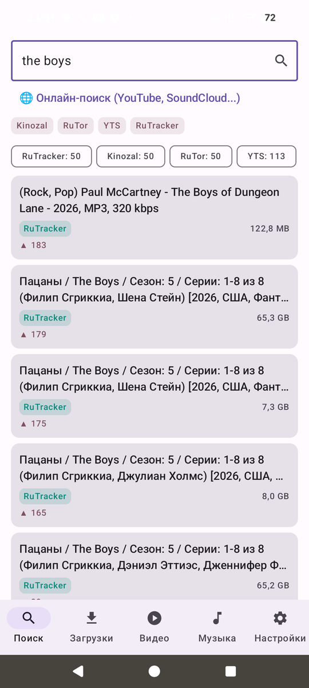
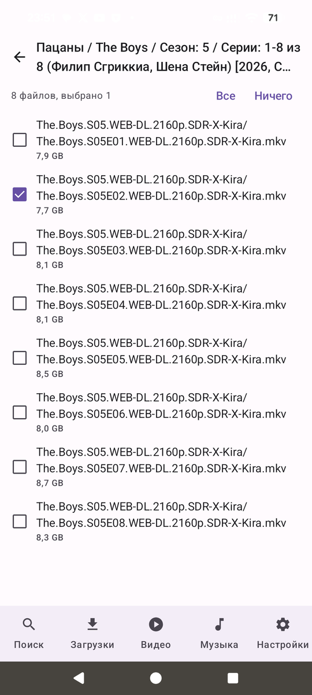
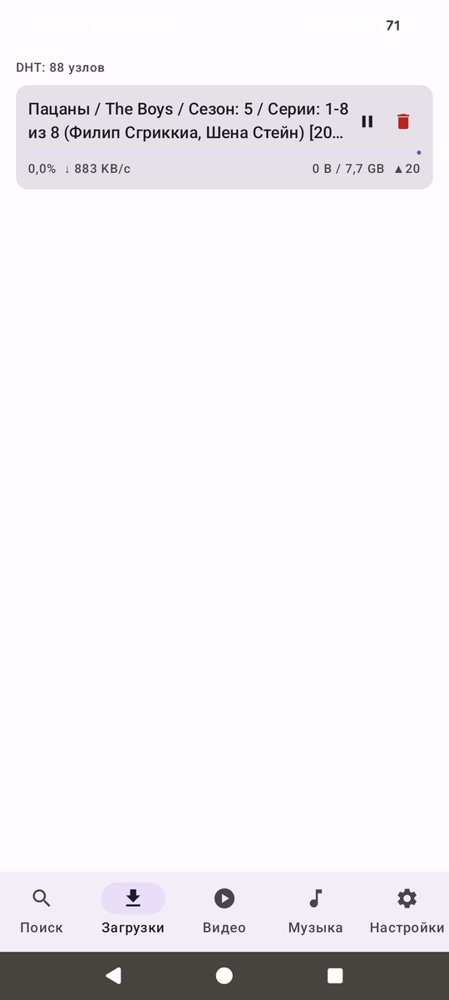
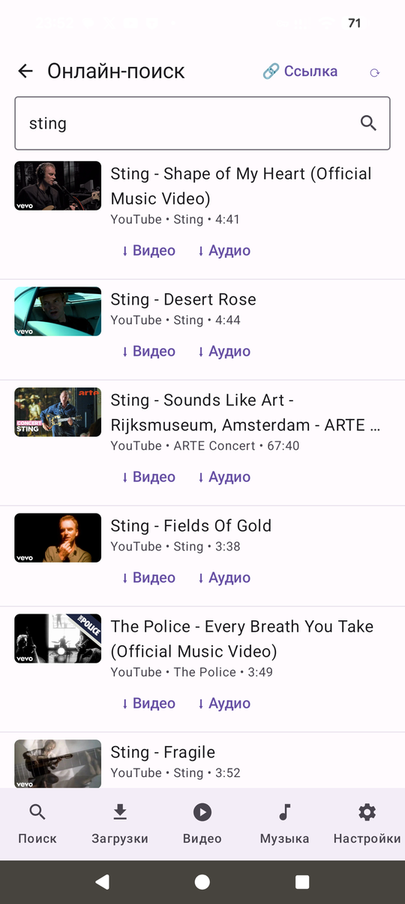
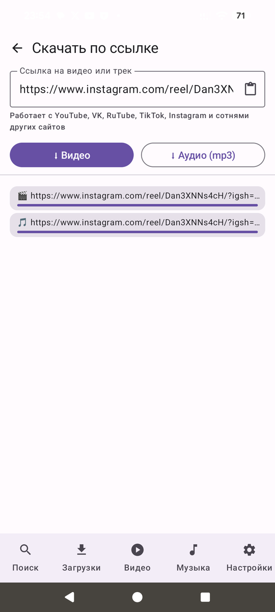
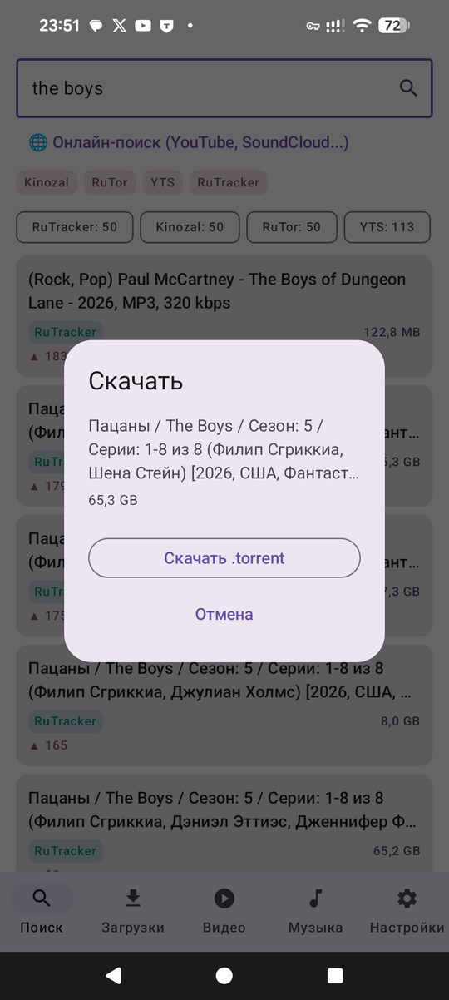
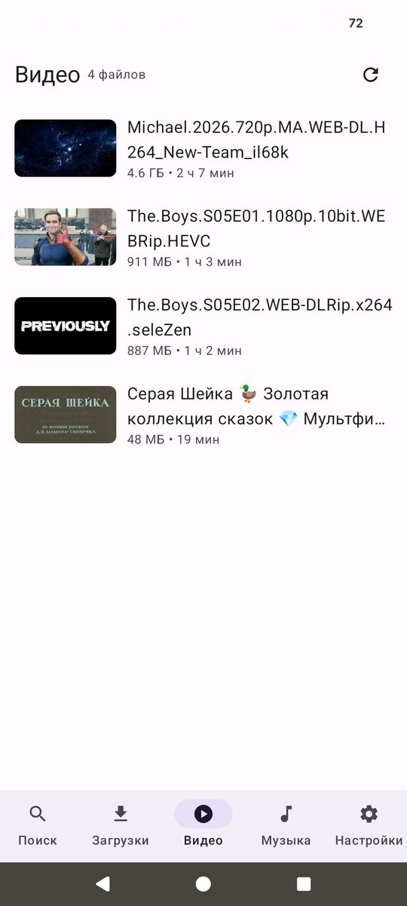
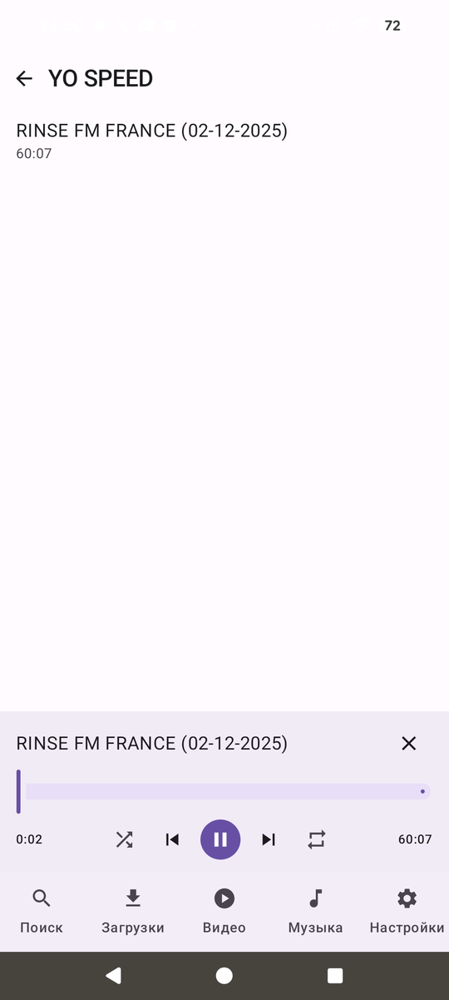
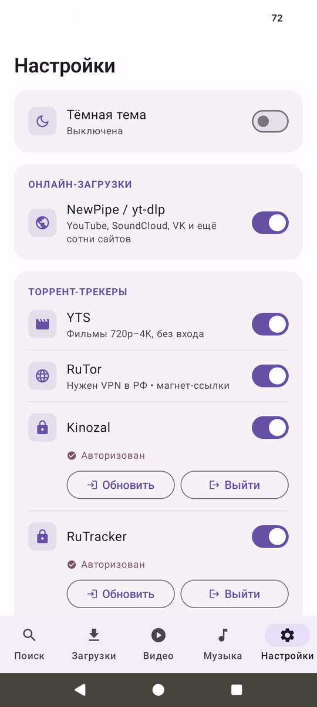

<div align="center">


# RuStream

**Поиск, скачивание и воспроизведение медиа — в одном приложении.**
Торрент-трекеры, YouTube/SoundCloud/VK и сотни других сайтов, встроенные плееры видео и музыки.

[](https://github.com/Komsomol39/rustream/actions/workflows/build.yml)
[](LICENSE)
[](#)
[](#)
[](#)

[](https://github.com/Komsomol39/rustream/releases/latest/download/app-release.apk)

</div>

---

## Возможности

**Поиск и загрузка**
- Торрент-поиск по нескольким трекерам сразу: YTS, RuTor, Kinozal, RuTracker, NNM-Club
- Авторизация на приватных трекерах через встроенный WebView (куки сохраняются)
- Скачивание magnet-ссылок и `.torrent`-файлов на встроенном движке libtorrent4j
- Выбор отдельных файлов внутри раздачи — можно качать только нужные серии
- Докачка поверх уже имеющихся файлов с фоновой проверкой хэшей и видимым прогрессом
- Онлайн-загрузки через NewPipe (поиск) + yt-dlp (скачивание): видео в лучшем качестве или аудио в mp3
- Скачивание по прямой ссылке с сотен сайтов (YouTube, VK, TikTok, Instagram и др.)

**Плеер и библиотека**
- Видеоплеер на Media3/ExoPlayer с FFmpeg-декодером (DTS, AC3 и другие дорожки), запоминает позицию просмотра
- Музыкальный плеер с фоновым воспроизведением, управлением из шторки и с экрана блокировки
- Перемешивание, повтор плейлиста/трека, «играть всё», группировка по исполнителям с объединением псевдонимов
- Превью-миниатюры для видео, подключение произвольных папок устройства как источников медиа

**Приложение**
- Автообновление: проверка новой версии при запуске (отключается в настройках), скачивание с прогрессом и установка через системный PackageInstaller — без ручной возни с APK
- Тёмная тема, Material 3, адаптивная иконка с поддержкой Material You

## Скриншоты

| Поиск по трекерам | Выбор файлов раздачи | Загрузки |
|:---:|:---:|:---:|
|  |  |  |

| Онлайн-поиск | Скачивание по ссылке | Скачивание раздачи |
|:---:|:---:|:---:|
|  |  |  |

| Видеотека | Музыкальный плеер | Настройки |
|:---:|:---:|:---:|
|  |  |  |

## Установка

1. Скачайте [`app-release.apk`](https://github.com/Komsomol39/rustream/releases/latest/download/app-release.apk) из последнего релиза.
2. Разрешите установку из неизвестных источников, если Android спросит.
3. Дальше приложение обновляется само: при выходе новой версии предложит скачать и установить её в один тап.

Приложение также можно найти через [RepoStore](https://github.com/samyak2403/RepoStore) — каталог Android-приложений, публикуемых на GitHub.

## Технологии

| Слой | Стек |
|---|---|
| Язык и UI | Kotlin, Jetpack Compose, Material 3 |
| Архитектура | MVVM, Hilt (DI), DataStore, Navigation Compose |
| Торренты | libtorrent4j (posix disk I/O), выделенный поток движка |
| Медиа | AndroidX Media3 (ExoPlayer, MediaSessionService) + Jellyfin FFmpeg decoder |
| Онлайн-загрузки | NewPipeExtractor, youtubedl-android (yt-dlp + FFmpeg) |
| Сеть и парсинг | OkHttp, Jsoup |

## Структура проекта

```
app/src/main/java/com/komsomol/rustream/
├── data/
│   ├── search/     # провайдеры трекеров (RuTracker, NNM, Kinozal, RuTor, YTS), куки, зеркала
│   ├── torrent/    # TorrentEngine (libtorrent4j) и репозиторий загрузок
│   ├── grab/       # онлайн-поиск (NewPipe) и скачивание (yt-dlp)
│   ├── music/      # медиатека, контроллер плеера, объединение исполнителей
│   ├── video/      # видеотека и превью
│   ├── update/     # внутриприложенческие обновления (version.json → PackageInstaller)
│   └── settings/   # DataStore-настройки
├── player/         # PlaybackService (MediaSessionService), PlayerActivity
├── service/        # foreground-сервис торрент-движка
└── ui/             # Compose-экраны: поиск, загрузки, видео, музыка, настройки
```

## Сборка

**CI (основной способ).** Каждый push в `main` запускает workflow [Build APK](.github/workflows/build.yml):
- собираются debug- и подписанный release-APK (ключ — в GitHub Secrets: `KEYSTORE_BASE64`, `KEYSTORE_PASSWORD`, `KEY_ALIAS`);
- версия нумеруется номером прогона: `versionCode = run_number`, `versionName = 1.0.<run_number>`;
- оба APK и `version.json` публикуются в релиз [`latest`](https://github.com/Komsomol39/rustream/releases/latest) — по нему работает автообновление в приложении;
- при ошибке компиляции лог пишется в `build-errors.txt` в корне репозитория.

**Локально** — стандартно для Android-проекта (JDK 17, Android SDK, только `arm64-v8a`):

```bash
./gradlew assembleDebug
```

Без переменных окружения подписи собирается debug-версия; release подписывается только в CI.

## Дисклеймер

Проект создан в образовательных целях. Приложение — универсальный клиент: оно не размещает и не распространяет контент. Пользователь сам отвечает за соблюдение авторских прав и условий использования сторонних сервисов в своей юрисдикции.

## Лицензия

[GPL-3.0](LICENSE). Выбор обусловлен зависимостями: [NewPipeExtractor](https://github.com/TeamNewPipe/NewPipeExtractor) и [youtubedl-android](https://github.com/yausername/youtubedl-android) распространяются под GPLv3, поэтому производное приложение обязано использовать совместимую лицензию.
